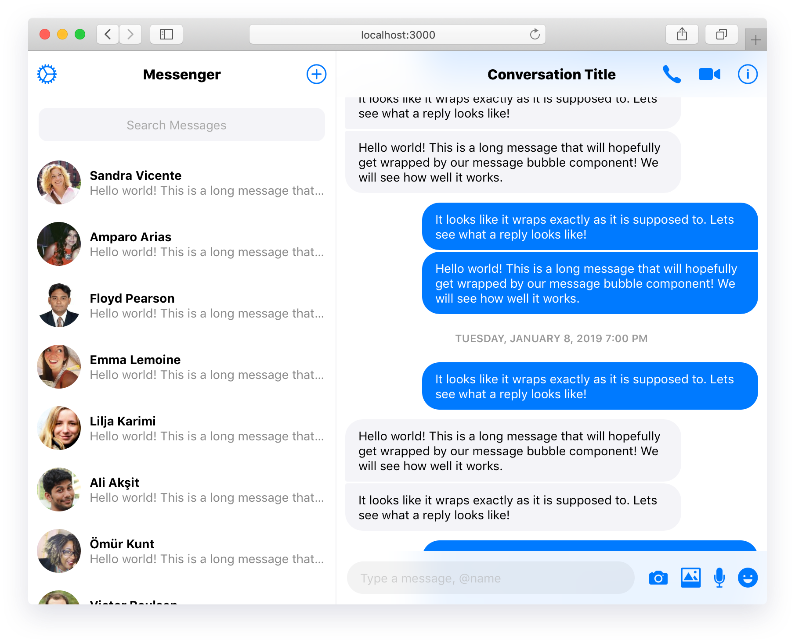

  
  <h1 align="center">React Messenger</h1>  

> This project uses React and CSS to recreate the Facebook Messenger web application. It is in its early stages but most of the building blocks are in place. **THIS IS NOT AN OFFICIAL FACEBOOK PRODUCT NOR IS IT MAINTAINED BY ANY FACEBOOK EMPLOYEES.**

<b><a href="https://zen-bell-45d9db.netlify.com/">CLICK HERE FOR A LIVE DEMO</a></b>

  

## Available Components

When using these components it is important to keep in mind that we are utilizing a few different dependencies to achieve a better user experience. Specifically:

- [Moment](https://momentjs.com/) for parsing JavaScript dates and printing them in a readable way.
- [Shave](https://github.com/dollarshaveclub/shave) to trim long messages to maintain consistency amongst `ConversationListItem`.
- [Axios](https://github.com/axios/axios) to facilitate HTTP requests (for messages, users, etc).

### Compose

The Compose component allows the user to send messages and attachments.

| props | type | description |
|-------|------|-------------|
| `rightItems` | `ToolbarButton[]` | Icons that appear to the right of the `input` element allowing users to send more than text (e.g. photos, cash, location, etc). |

### ConversationList

This is a simple component that renders `ConversationSearch` and uses `axios` to fetch users from the [Random User API](https://randomuser.me/).

### ConversationListItem

This component provides an overview of a single conversation, including a photo, name (or group title), and a snippet of the most recent message. We use `shave` to trim the displayed message so that all instances of `ConversationListItem` take up the same amount of vertical space.

| props | type | description |
|-------|------|-------------|
| `photo` | `String` | The URL of a photo to be displayed for the conversation. The demo uses the photo provided by the Random User API. |
| `name` | `String` | The name of the conversation, whether it is a group or individual. |
| `text` | `String` | The text of the most recent message; you do not have to truncate this yourself. |

### ConversationSearch

This is a simple `input` element that is styled to resemble the Facebook Messenger search bar. Its placeholder is centered until the input is focused, moving the placeholder to the left.

### Message

Because most of the work is done by `MessageList`, this component is pretty straight-forward. As stated below, there are a lot of `props` which allow you to style distinct groups of messages.

| props | type | description |
|-------|------|-------------|
| `data` | `Object` | An object containing information about the message. We use `data.message` for the message body and `data.timestamp` for the JavaScript Date object representing the time at which the message was sent. |
| `isMine` | `Boolean` | Applies a tint to the message (`#007aff` in demo) and aligns it to the right, indicating that the message was sent by you. |
| `startsSequence` | `Boolean` | Indicates that the message represents the start of a sequence of messages. This sets the appropriate top border radius, depending on whether the message was sent by you or someone else. |
| `endsSequence` | `Boolean` | Indicates that the message represents the end of a sequence of messages. This sets the appropriate bottom border radius, depending on whether the message was sent by you or someone else. |
| `showTimestamp` | `Boolean` | Determines whether or not the timestamp of the message should be shown. The demo app sets this value to `true` if more than one hour has passed between messages. |

### MessageList

This is a deceptively-simple component that does a lot of the heavy lifting for rendering sequences of messages with appropriate styling (see `MessageList.renderMessages`). Specifically, we use information about the messages (`author` and `timestamp`) to render groups of messages closer together with modified border-radii and margin. This is not just present in Facebook Messenger, but in other apps like iMessage as well. You can remove this functionality if you want to.

### Messenger

This component is essentially the wrapper for the web application. It defines a [CSS Grid](https://css-tricks.com/snippets/css/complete-guide-grid/) layout and exposes some helper classes (e.g. `scrollable`, allowing us to separate scrolling between the sidebar and content panes).

### Toolbar

The demo uses two toolbars which sit above the sidebar and content panes. This component displays a title and can also include buttons. The title remains centered within the Toolbar regardless of whether elements are present on either side.

| props | type | description |
|-------|------|-------------|
| `title` | `String` | The title to be displayed in the center of the toolbar. |
| `leftItems` | `ToolbarButton[]` | The `ToolbarButton` elements that should appear on the left side of the toolbar. |
| `rightItems` | `ToolbarButton[]` | The `ToolbarButton` elements that should appear on the right side of the toolbar. |

### ToolbarButton

Probably better described as an "icon button," it is just that -- a button that shows an icon. I will add accessibility considerations in time.

| props | type | description |
|-------|------|-------------|
| `icon` | `String` | The name of the icon to be represented via an icon font. I use [Ionicons](https://ionicons.com/) in the demo but this could easily be swapped out for [FontAwesome](https://fontawesome.com/) or a similar library. You can even make your own icon font at [Icomoon](https://icomoon.io/). |

## Roadmap

This is a rather straight-forward library but I do plan to continue making improvements and adding features. If you would like to contribute, you are more than welcome to.

- [ ] Media messages (e.g. photos, videos)
- [ ] Tooltips, popovers, modals (for viewing options, sending new messages, etc)
- [ ] Graceful degradation (network status indicator, loading spinners, etc)
- [ ] Responsiveness

## Available Scripts

In the project directory, you can run:

### `npm start`

Runs the app in the development mode. 
Open [http://localhost:3000](http://localhost:3000) to view it in the browser.

The page will reload if you make edits. 
You will also see any lint errors in the console.

### `npm test`

Launches the test runner in the interactive watch mode. 
See the section about [running tests](https://facebook.github.io/create-react-app/docs/running-tests) for more information.

### `npm run build`

Builds the app for production to the `build` folder. 
It correctly bundles React in production mode and optimizes the build for the best performance.

The build is minified and the filenames include the hashes. 
Your app is ready to be deployed!

See the section about [deployment](https://facebook.github.io/create-react-app/docs/deployment) for more information.

### `npm run eject`

**Note: this is a one-way operation. Once you `eject`, you can’t go back!**

If you aren’t satisfied with the build tool and configuration choices, you can `eject` at any time. This command will remove the single build dependency from your project.

Instead, it will copy all the configuration files and the transitive dependencies (Webpack, Babel, ESLint, etc) right into your project so you have full control over them. All of the commands except `eject` will still work, but they will point to the copied scripts so you can tweak them. At this point you’re on your own.

You don’t have to ever use `eject`. The curated feature set is suitable for small and middle deployments, and you shouldn’t feel obligated to use this feature. However we understand that this tool wouldn’t be useful if you couldn’t customize it when you are ready for it.

## Learn More

You can learn more in the [Create React App documentation](https://facebook.github.io/create-react-app/docs/getting-started).

To learn React, check out the [React documentation](https://reactjs.org/).

### Code Splitting

This section has moved here: https://facebook.github.io/create-react-app/docs/code-splitting

### Analyzing the Bundle Size

This section has moved here: https://facebook.github.io/create-react-app/docs/analyzing-the-bundle-size

### Making a Progressive Web App

This section has moved here: https://facebook.github.io/create-react-app/docs/making-a-progressive-web-app

### Advanced Configuration

This section has moved here: https://facebook.github.io/create-react-app/docs/advanced-configuration

### Deployment

This section has moved here: https://facebook.github.io/create-react-app/docs/deployment

### `npm run build` fails to minify

This section has moved here: https://facebook.github.io/create-react-app/docs/troubleshooting#npm-run-build-fails-to-minify
